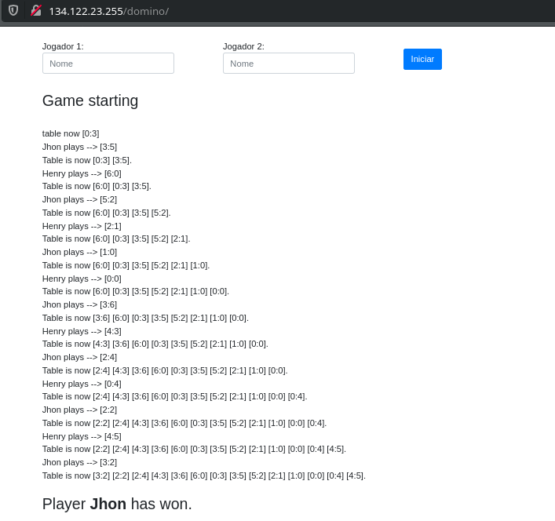

## About this game

This is a simulation of a domino game, it is not iterative, the system makes the moves internally and shows the result to the user.  

##### online project in this [link](http://134.122.23.255/domino/ "Click and access now") 

Image of preview


## Step by step to start the project

#### First
Clone this repository
```json
git clone https://github.com/jos3duardo/domino-php.git
```

Into this folder
```json
cd domino-php
```

#### Second
Run the command
```json
composer install
```

#### Third
Start the server PHP
```json
php -S localhost:8000
```

#### Fourth 
Open this navigator in this URL [localhost:8000](http://localhost:8000/)

#### Fifth
Enter the names of the players and start